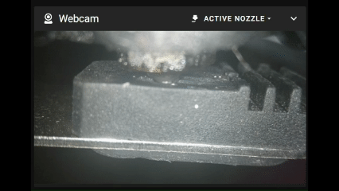

# RatOS IDEX Active Nozzle Camera

Automatically switches a single Mainsail webcam feed between the T0 and T1 nozzle cameras based on the active RatOS IDEX toolhead. Supports cameras connected directly to the printer Pi or hosted on a separate Raspberry Pi.

The design supports both common layouts:

1. **Local cameras** — both nozzle cameras are connected directly to the RatRig/RatOS Pi.
2. **Remote camera host** — the cameras are connected to a second Raspberry Pi or other Linux host, while Klipper/RatOS runs on the printer Pi.

The Klipper side watches the actual active extruder (`extruder` / `extruder1`). It does not replace or edit RatOS's stock `_SELECT_TOOL` macro.

## Demo



Animated demo of the Active Nozzle webcam feed following real RatOS IDEX tool changes in Mainsail.

## How it works

```text
T0 camera stream ─┐
                  ├─> Active Nozzle Camera service ─> one stable MJPEG URL ─> Mainsail
T1 camera stream ─┘
                            ^
                            |
                   RatOS active tool watcher
```

The switcher exposes:

- `/?action=stream` — active MJPEG stream
- `/?action=snapshot` — snapshot from the active camera
- `/status` — current selected tool
- `/health` — simple health response
- `/select?tool=0` — select T0
- `/select?tool=1` — select T1

## Requirements

### Camera host

- Linux with systemd
- Python 3
- Existing T0 and T1 MJPEG camera streams
- The source streams must be reachable from the host running the switcher

### RatOS printer

- RatOS / Klipper
- `gcode_shell_command` support
- `curl`
- Standard RatOS IDEX extruder names: `extruder` for T0 and `extruder1` for T1

The installer never restarts Klipper automatically.

## Quick install

Clone or copy this project to the appropriate machine.

Make the scripts executable:

```bash
chmod +x install.sh uninstall.sh verify.sh
```

### Option A — Cameras connected directly to the RatRig Pi

Run on the RatRig Pi:

```bash
./install.sh local
```

The installer will ask for the full T0 and T1 stream URLs. Example:

```text
T0: http://127.0.0.1:8080/?action=stream
T1: http://127.0.0.1:8081/?action=stream
```

It installs both the camera switcher and the Klipper integration.

### Option B — Cameras on a separate Raspberry Pi

On the camera Pi:

```bash
./install.sh camera-host
```

Enter the existing T0 and T1 stream URLs as seen from that camera Pi.

Then on the RatOS printer Pi:

```bash
./install.sh printer
```

Enter the camera host's IP/hostname and active stream port when prompted.

Example:

```text
Switcher host: 192.168.1.50
Switcher port: 8084
```

## Mainsail webcam

After installing the camera-host portion, add one webcam to Mainsail.

For cameras connected directly to the printer Pi:

```text
Stream URL:   http://<PRINTER-IP>:8084/?action=stream
Snapshot URL: http://<PRINTER-IP>:8084/?action=snapshot
```

For a separate camera Pi:

```text
Stream URL:   http://<CAMERA-PI-IP>:8084/?action=stream
Snapshot URL: http://<CAMERA-PI-IP>:8084/?action=snapshot
```

Use the Mainsail webcam service type that correctly displays your MJPEG stream. Some installations work with **MJPEG-Streamer**, while others require **MJPEG-Streamer experimental**.

## Test before restarting Klipper

Test the camera host manually:

```bash
curl -s 'http://127.0.0.1:8084/status'
curl -s 'http://127.0.0.1:8084/select?tool=1'
curl -s 'http://127.0.0.1:8084/select?tool=0'
```

For a remote camera host, replace `127.0.0.1` with its IP address.

You can also run:

```bash
./verify.sh <switcher-host> [port]
```

Example:

```bash
./verify.sh 192.168.1.50 8084
```

## Klipper restart

The printer installer adds:

```ini
[include active_nozzle_camera.cfg]
```

to `printer.cfg` if it is not already present.

**The installer does not restart Klipper.** Finish any active print first, then restart Klipper from Mainsail or with your normal workflow.

After restart:

1. Display the Active Nozzle webcam.
2. Select T1 and verify the feed changes to T1.
3. Select T0 and verify it returns to T0.
4. Run a small two-tool print and verify the feed follows actual tool changes.

## Tested Hardware

Initial development and validation were performed on:

- RatRig V-Core 4 IDEX
- RatOS 2.1
- Dual nozzle cameras
- MJPEG camera streams
- Mainsail
- Separate Raspberry Pi camera host

The Active Nozzle feed was validated during a real two-color IDEX print and switched correctly on every tool change.

## Configuration files

### Camera host

The camera switcher reads:

```text
/etc/default/active-nozzle-camera
```

Example:

```bash
ACTIVE_CAMERA_LISTEN_HOST=0.0.0.0
ACTIVE_CAMERA_LISTEN_PORT=8084
T0_STREAM_URL=http://127.0.0.1:8080/?action=stream
T0_SNAPSHOT_URL=http://127.0.0.1:8080/?action=snapshot
T1_STREAM_URL=http://127.0.0.1:8081/?action=stream
T1_SNAPSHOT_URL=http://127.0.0.1:8081/?action=snapshot
ACTIVE_CAMERA_TOKEN=
```

If the snapshot URL is blank, the service extracts a JPEG frame from the stream instead.

### Printer side

The installer creates:

```text
~/printer_data/config/active_nozzle_camera.cfg
~/printer_data/config/scripts/active_nozzle_camera.sh
```

The shell helper sends a short HTTP request to the camera switcher only when Klipper detects that the active tool changed.

## Optional token

The camera-host installer can configure an optional shared token.

If enabled, `/select` requires the token and the printer helper includes it automatically.

This is not intended to provide Internet-facing security. Keep the service on a trusted LAN and do not expose it directly to the public Internet.

## Uninstall

### Local installation

```bash
./uninstall.sh local
```

### Remote camera host

On the camera host:

```bash
./uninstall.sh camera-host
```

On the printer:

```bash
./uninstall.sh printer
```

The uninstaller does not restart Klipper.

## Notes

- Existing camera services are not modified.
- Existing individual T0/T1 webcam entries can remain in Mainsail.
- The Active Nozzle feed is an additional logical webcam.
- The switcher re-emits JPEG frames with its own MJPEG boundary, so the two source cameras do not need to use identical multipart boundaries.
- A camera host restart defaults the switcher to T0 until the printer side sends another tool selection.
- Licensed under the GNU General Public License v3.0 (GPL-3.0).

## License

This project is licensed under the **GNU General Public License v3.0 (GPL-3.0)**. See `LICENSE` for the full license text.
